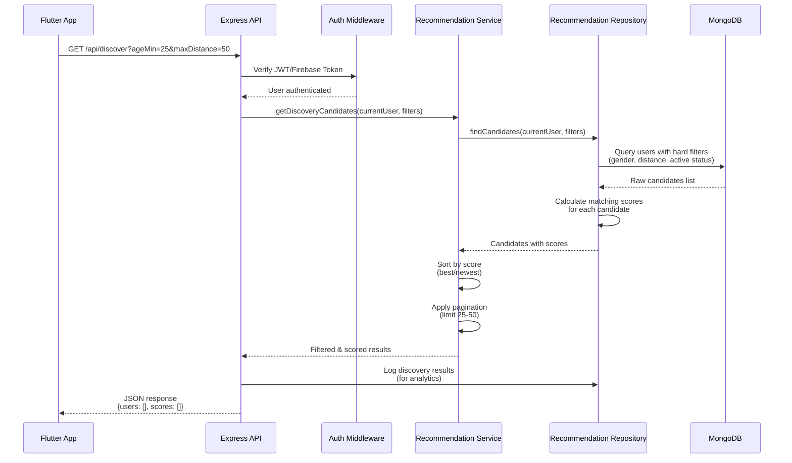
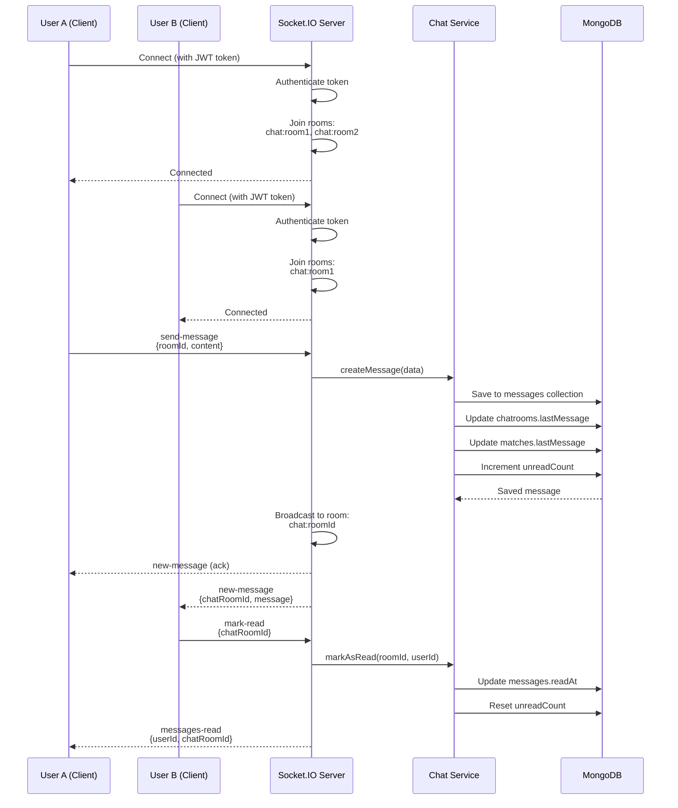
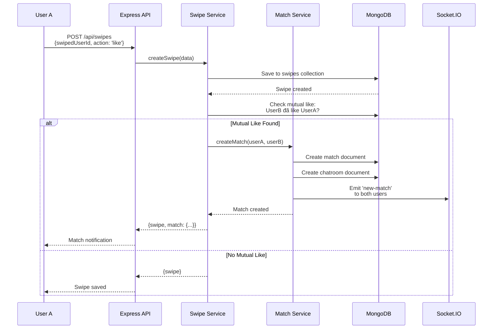
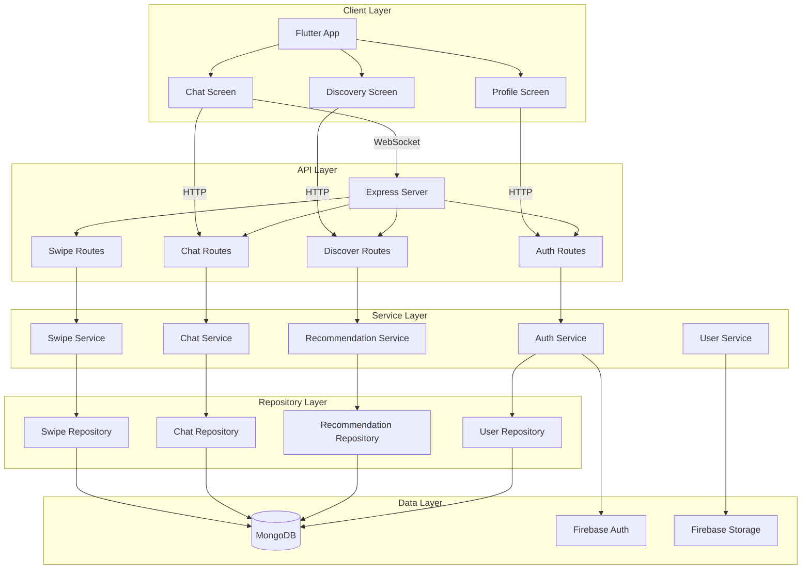
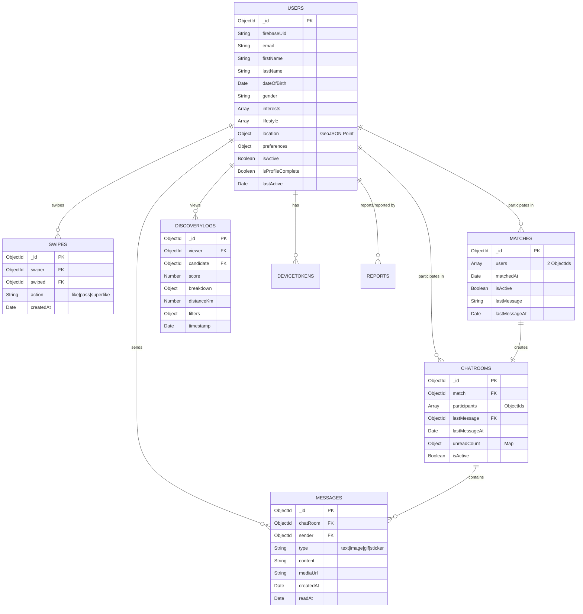

# Hiện thực hóa Kỹ thuật - Matcha
## Ứng dụng Hẹn hò & Chat

---

## 📋 Tổng quan

Tài liệu này mô tả chi tiết về **kiến trúc kỹ thuật và cách hiện thực hóa** hệ thống ứng dụng hẹn hò Matcha, bao gồm:

- **Tech Stack Overview**: Tổng quan các công nghệ sử dụng theo từng tầng
- **System Architecture**: Kiến trúc hệ thống và luồng dữ liệu
- **Key Algorithms**: Thuật toán tính điểm Matching Score
- **Database Design**: Thiết kế cơ sở dữ liệu

---

## 1. 📦 Tech Stack Overview

### 1.1. Frontend Layer

#### **Flutter Framework**
- **Version**: 3.22+
- **Ngôn ngữ**: Dart
- **Lý do lựa chọn**:
  - **Cross-platform**: Một codebase duy nhất cho cả Android và iOS, giảm 50% thời gian phát triển
  - **Hiệu năng cao**: Native performance nhờ Ahead-of-Time (AOT) compilation
  - **Hot Reload**: Tăng tốc độ phát triển với khả năng reload nhanh
  - **Rich Widget Library**: Cung cấp đầy đủ components UI hiện đại
  - **Mature Ecosystem**: Hỗ trợ tốt từ Google và cộng đồng lớn

#### **State Management: Riverpod**
- **Version**: 2.4.9
- **Lý do lựa chọn**:
  - **Type-safe**: Compile-time safety, giảm lỗi runtime
  - **Dependency Injection**: Quản lý dependencies tự động
  - **Testing friendly**: Dễ dàng mock và test
  - **Performance**: Tối ưu re-render, chỉ rebuild widgets cần thiết
  - **Modern**: Thay thế Provider với API tốt hơn

#### **Navigation: GoRouter**
- **Version**: 13.0.0
- **Lý do lựa chọn**:
  - **Declarative routing**: Định nghĩa routes rõ ràng, dễ maintain
  - **Deep linking**: Hỗ trợ URL-based navigation
  - **Type-safe**: Navigation với type checking
  - **Nested routing**: Hỗ trợ nested routes phức tạp

#### **Networking: Dio**
- **Version**: 5.4.0
- **Lý do lựa chọn**:
  - **HTTP client mạnh mẽ**: Hỗ trợ interceptors, transformers, cancel requests
  - **Request/Response interceptors**: Dễ dàng xử lý authentication, logging, error handling
  - **Timeout & retry**: Tự động retry khi request thất bại
  - **FormData support**: Upload file dễ dàng

#### **Realtime Communication: Socket.IO Client**
- **Version**: 2.0.3+1
- **Lý do lựa chọn**:
  - **Bi-directional communication**: Real-time chat không cần polling
  - **Automatic reconnection**: Tự động kết nối lại khi mất kết nối
  - **Event-based**: Dễ dàng xử lý các events (new-message, typing, etc.)
  - **Cross-platform**: Hoạt động trên tất cả platforms

#### **Firebase Integration**
- **firebase_core**: 3.6.0
- **firebase_auth**: 5.3.1 - Xác thực người dùng
- **firebase_storage**: 12.3.2 - Lưu trữ ảnh
- **firebase_messaging**: 15.1.3 - Push notifications
- **Lý do lựa chọn**:
  - **Backend as a Service**: Giảm công sức xây dựng backend cho auth, storage
  - **Scalability**: Tự động scale, không cần quản lý infrastructure
  - **Security**: Firebase Security Rules đảm bảo bảo mật dữ liệu
  - **Google Sign-In**: Tích hợp sẵn Google authentication

#### **UI Libraries**
- **cached_network_image**: 3.3.1 - Tải và cache ảnh hiệu quả
- **image_picker**: 1.0.7 - Chọn ảnh từ gallery/camera
- **shimmer**: 3.0.0 - Loading skeleton UI
- **reorderable_grid_view**: 2.2.8 - Drag & drop ảnh khi chỉnh sửa profile

---

### 1.2. Backend Layer

#### **Node.js Runtime**
- **Version**: 18+
- **Lý do lựa chọn**:
  - **JavaScript/TypeScript**: Cùng ngôn ngữ với frontend, dễ maintain
  - **Non-blocking I/O**: Xử lý nhiều requests đồng thời hiệu quả
  - **V8 Engine**: Hiệu năng cao, được Google tối ưu
  - **Rich Ecosystem**: npm package repository lớn nhất thế giới
  - **Real-time support**: Hỗ trợ tốt WebSocket/Socket.IO

#### **Express.js Framework**
- **Version**: 4.18.2
- **Lý do lựa chọn**:
  - **Minimal & Flexible**: Framework nhẹ, dễ tùy biến
  - **Middleware**: Hệ thống middleware mạnh mẽ (auth, validation, logging)
  - **Routing**: Hỗ trợ RESTful routing dễ dàng
  - **Mature**: Framework phổ biến nhất, nhiều tài liệu và ví dụ
  - **Performance**: Đủ nhanh cho hầu hết use cases

#### **MongoDB + Mongoose**
- **MongoDB**: Cloud Atlas (managed service)
- **Mongoose**: 8.0.3 (ODM)
- **Lý do lựa chọn**:
  - **NoSQL**: Schema linh hoạt, phù hợp với dữ liệu user profile (nested objects, arrays)
  - **Geospatial queries**: Hỗ trợ native cho tính năng tìm kiếm theo vị trí (2dsphere index)
  - **Horizontal scaling**: Dễ dàng scale out khi cần
  - **JSON-like documents**: Dễ dàng serialize/deserialize với JavaScript
  - **Mongoose ODM**: Validation, middleware, query building dễ dàng

#### **Socket.IO**
- **Version**: 4.6.1
- **Lý do lựa chọn**:
  - **Real-time bidirectional communication**: Chat realtime không cần polling
  - **Automatic fallback**: Tự động fallback từ WebSocket sang HTTP long-polling
  - **Rooms & namespaces**: Quản lý chat rooms dễ dàng
  - **Authentication middleware**: Tích hợp xác thực với JWT/Firebase token
  - **Event-based architecture**: Dễ dàng xử lý các events (send-message, typing, etc.)

#### **Firebase Admin SDK**
- **Version**: 12.0.0
- **Lý do lựa chọn**:
  - **Token verification**: Xác thực Firebase ID tokens từ client
  - **Storage management**: Upload/quản lý files trên Firebase Storage
  - **Server-side operations**: Thực hiện các thao tác cần quyền admin

#### **Security & Performance Libraries**
- **helmet**: 7.1.0 - Bảo mật HTTP headers
- **cors**: 2.8.5 - Cross-Origin Resource Sharing
- **express-rate-limit**: 7.1.5 - Giới hạn số lượng requests (chống DDoS)
- **compression**: 1.7.4 - Nén response (gzip)
- **winston**: 3.11.0 - Structured logging
- **jsonwebtoken**: 9.0.2 - JWT authentication
- **bcryptjs**: 2.4.3 - Hash passwords

---

### 1.3. Database Layer

#### **MongoDB Atlas (Cloud)**
- **Service**: Managed MongoDB
- **Lý do lựa chọn**:
  - **Fully managed**: Không cần quản lý server, backup, monitoring
  - **Auto-scaling**: Tự động scale theo nhu cầu
  - **High availability**: Replica sets đảm bảo uptime 99.95%+
  - **Global distribution**: Có thể đặt clusters gần users
  - **Security**: Encryption at rest, in transit, network isolation

#### **Database Indexes**
- **2dsphere index** trên `users.location.coordinates`: Tối ưu geospatial queries
- **Compound indexes** trên `matches.users`, `chatrooms.participants`: Tăng tốc độ query
- **TTL indexes** (future): Tự động xóa logs cũ

---

### 1.4. Infrastructure Layer

#### **Docker**
- **Containerization**: Đóng gói ứng dụng và dependencies
- **Lý do lựa chọn**:
  - **Consistency**: Môi trường dev/prod giống nhau
  - **Isolation**: Tách biệt dependencies, không conflict
  - **Portability**: Chạy trên mọi platform hỗ trợ Docker
  - **Scalability**: Dễ dàng scale với Docker Compose hoặc Kubernetes

#### **Firebase Services**
- **Firebase Authentication**: Xác thực người dùng (Email/Password, Google)
- **Firebase Storage**: Lưu trữ ảnh profile (scalable, CDN)
- **Firebase Cloud Messaging (FCM)**: Push notifications cho match/message
- **Lý do lựa chọn**:
  - **Serverless**: Không cần quản lý infrastructure
  - **Global CDN**: Ảnh được phân phối nhanh toàn cầu
  - **Integration**: Tích hợp tốt với Flutter và Node.js

---

## 2. 🏗️ System Architecture

### 2.1. Kiến trúc Tổng quan

Hệ thống Matcha được xây dựng theo mô hình **3-tier architecture**:

```
┌─────────────────────────────────────────────────────────────┐
│                    CLIENT LAYER (Frontend)                  │
│                    Flutter Mobile App                        │
│  ┌────────────┐  ┌────────────┐  ┌────────────┐            │
│  │ Discovery  │  │   Chat     │  │  Profile   │            │
│  │  Screen    │  │   Screen   │  │  Screen    │            │
│  └─────┬──────┘  └─────┬──────┘  └─────┬──────┘            │
│        │               │                │                    │
│        └───────────────┼────────────────┘                    │
│                        │                                     │
│              ┌─────────▼─────────┐                          │
│              │   API Service     │                          │
│              │   (Dio Client)    │                          │
│              └─────────┬─────────┘                          │
│                        │                                     │
│              ┌─────────▼─────────┐                          │
│              │  Socket.IO Client │                          │
│              └─────────┬─────────┘                          │
└────────────────────────┼────────────────────────────────────┘
                         │
                         │ HTTPS / WSS
                         │
┌────────────────────────▼────────────────────────────────────┐
│              APPLICATION LAYER (Backend)                    │
│                    Node.js + Express                        │
│  ┌──────────────────────────────────────────────────────┐  │
│  │              Express Server                          │  │
│  │  ┌──────────────┐  ┌──────────────┐                 │  │
│  │  │ REST API     │  │ Socket.IO    │                 │  │
│  │  │ Routes       │  │ Server       │                 │  │
│  │  └──────┬───────┘  └──────┬───────┘                 │  │
│  │         │                  │                          │  │
│  │  ┌──────▼──────────────────▼───────┐                 │  │
│  │  │     Controllers & Services      │                 │  │
│  │  │  - Auth Service                 │                 │  │
│  │  │  - Recommendation Service       │                 │  │
│  │  │  - Chat Service                 │                 │  │
│  │  │  - User Service                 │                 │  │
│  │  └──────┬──────────────────┬───────┘                 │  │
│  │         │                  │                          │  │
│  │  ┌──────▼──────────────────▼───────┐                 │  │
│  │  │     Repositories Layer          │                 │  │
│  │  │  - User Repository              │                 │  │
│  │  │  - Recommendation Repository    │                 │  │
│  │  │  - Chat Repository              │                 │  │
│  │  └──────┬──────────────────┬───────┘                 │  │
│  └─────────┼──────────────────┼─────────────────────────┘  │
│            │                  │                             │
│            │                  │                             │
└────────────┼──────────────────┼─────────────────────────────┘
             │                  │
             │                  │
    ┌────────▼────────┐  ┌──────▼──────────┐
    │    MongoDB      │  │   Firebase      │
    │    Atlas        │  │   Services      │
    │                 │  │  - Auth         │
    │  - Users        │  │  - Storage      │
    │  - Matches      │  │  - Messaging    │
    │  - Messages     │  │                 │
    │  - Swipes       │  │                 │
    └─────────────────┘  └─────────────────┘
```

---

### 2.2. Luồng Dữ liệu (Data Flow)

#### 2.2.1. Luồng Discovery (Tìm kiếm người phù hợp)



**Chi tiết các bước:**

1. **Client Request**: Flutter app gửi GET request đến `/api/discover` với query params (ageMin, ageMax, maxDistance, lifestyle, interests, etc.)

2. **Authentication**: Middleware xác thực JWT hoặc Firebase token

3. **Hard Filters**: Repository query MongoDB với các điều kiện cứng:
   - Gender matching
   - Distance ≤ maxDistance (sử dụng `$near` với 2dsphere index)
   - `isActive = true` và `isProfileComplete = true`
   - Chưa swipe trước đó (loại bỏ users trong `swipes` collection)

4. **Scoring**: Recommendation Service tính điểm cho mỗi candidate:
   - Interests overlap (40%)
   - Lifestyle overlap (20%)
   - Distance score (20%)
   - Activity score (10%)
   - Age compatibility (10%)

5. **Sorting & Pagination**: Sắp xếp theo score (best) hoặc createdAt (newest), giới hạn 25-50 results

6. **Logging**: Lưu discovery logs vào `discoverylogs` collection để phân tích sau

7. **Response**: Trả về JSON với danh sách users và matching scores

---

#### 2.2.2. Luồng Chat Realtime (Socket.IO)



**Chi tiết các bước:**

1. **Connection**: Client kết nối Socket.IO với JWT token trong `handshake.auth.token`

2. **Authentication**: Server xác thực token (JWT hoặc Firebase), lưu `socket.userId`

3. **Join Rooms**: Client tự động join tất cả chat rooms của user (`join-chat-rooms` event)

4. **Send Message**: 
   - Client emit `send-message` với `{chatRoomId, content, type}`
   - Server validate quyền (user phải là participant)
   - Lưu message vào MongoDB
   - Update `chatrooms.lastMessage`, `matches.lastMessage`
   - Increment `unreadCount` cho recipient

5. **Broadcast**: Server emit `new-message` đến tất cả clients trong room (`chat:roomId`)

6. **Mark Read**:
   - Client emit `mark-read` khi xem tin nhắn
   - Server update `messages.readAt` và reset `unreadCount`
   - Notify sender qua `messages-read` event

---

#### 2.2.3. Luồng Swipe & Match



**Chi tiết các bước:**

1. **Swipe Action**: User A swipe (like/pass/superlike) User B

2. **Save Swipe**: Lưu vào `swipes` collection với:
   - `swiper`: User A ID
   - `swiped`: User B ID
   - `action`: 'like' | 'pass' | 'superlike'
   - `createdAt`: timestamp

3. **Check Mutual Like**: Query xem User B đã like User A chưa

4. **Create Match** (nếu mutual like):
   - Tạo document trong `matches` collection
   - Tạo `chatrooms` document với `match` reference
   - Emit `new-match` event qua Socket.IO đến cả hai users
   - Trigger push notification (FCM)

5. **Response**: Trả về swipe result, nếu có match thì kèm match info

---

### 2.3. Component Interaction



---

## 3. 🔬 Key Algorithms

### 3.1. Matching Score Algorithm

Thuật toán tính điểm phù hợp (Matching Score) là **core algorithm** của hệ thống, quyết định thứ tự hiển thị các profile trong Discovery.

#### 3.1.1. Tổng quan

Matching Score được tính dựa trên **5 yếu tố** với trọng số khác nhau, sau đó được chuẩn hóa về thang điểm 0-100.

**Công thức tổng quát:**

$$
S_{final} = \min\left(100, \left\lfloor \frac{\sum_{i=1}^{5} w_i \times f_i}{W_{total}} \times 100 \right\rfloor \right)
$$

Trong đó:
- $w_i$: Trọng số của yếu tố thứ $i$
- $f_i$: Hàm tính điểm cho yếu tố thứ $i$ (0-1)
- $W_{total} = 100$: Tổng trọng số

#### 3.1.2. Chi tiết từng yếu tố

##### **1. Interests Overlap Score** ($w_{interests} = 40$)

**Mục đích**: Đo lường mức độ trùng lặp sở thích giữa hai users.

**Công thức Jaccard Similarity (Modified):**

$$
S_{interests} = w_{interests} \times \frac{|I_A \cap I_B|}{\max(|I_A|, |I_B|)}
$$

**Implementation:**

```javascript
#calcOverlapScore(listA, listB, weight) {
  if (!listA?.length || !listB?.length) return { points: 0 };
  
  const setB = new Set(listB);
  const overlap = listA.filter(item => setB.has(item));
  const denominator = Math.max(listA.length, listB.length);
  
  return { 
    points: Math.min(weight, (overlap.length / denominator) * weight) 
  };
}
```

**Ví dụ:**
- User A: `['travel', 'music', 'coffee', 'photography', 'cooking']` (5 items)
- User B: `['music', 'coffee', 'gaming']` (3 items)
- Overlap: `['music', 'coffee']` (2 items)
- Score: $40 \times \frac{2}{5} = 16$ điểm

---

##### **2. Lifestyle Overlap Score** ($w_{lifestyle} = 20$)

**Mục đích**: Đo lường mức độ tương đồng về lối sống.

**Công thức tương tự Interests:**

$$
S_{lifestyle} = w_{lifestyle} \times \frac{|L_A \cap L_B|}{\max(|L_A|, |L_B|)}
$$

**Lifestyle Options:**
- `hiking`, `nightlife`, `vegan`, `pet-lover`, `early-bird`, `night-owl`, `minimalist`, `spiritual`, `fitness`, `traveling`, `family-oriented`, `career-focused`

**Ví dụ:**
- User A: `['fitness', 'early-bird', 'pet-lover']` (3 items)
- User B: `['fitness', 'night-owl']` (2 items)
- Overlap: `['fitness']` (1 item)
- Score: $20 \times \frac{1}{3} \approx 6.67$ điểm

---

##### **3. Distance Score** ($w_{distance} = 20$)

**Mục đích**: Ưu tiên người dùng ở gần hơn.

**Công thức Linear Decay:**

$$
S_{distance} = \max\left(0, w_{distance} \times \left(1 - \frac{d}{d_{max}}\right)\right)
$$

Trong đó:
- $d$: Khoảng cách thực tế (km) - tính bằng Haversine formula
- $d_{max}$: Khoảng cách tối đa cho phép (từ preferences của User A)

**Haversine Formula** (tính khoảng cách giữa 2 điểm trên Trái Đất):

$$
a = \sin^2\left(\frac{\Delta\phi}{2}\right) + \cos(\phi_1) \cdot \cos(\phi_2) \cdot \sin^2\left(\frac{\Delta\lambda}{2}\right)
$$

$$
c = 2 \cdot \arctan2(\sqrt{a}, \sqrt{1-a})
$$

$$
d = R \cdot c
$$

Với:
- $\phi_1, \phi_2$: Vĩ độ (latitude) của User A và User B (rad)
- $\lambda_1, \lambda_2$: Kinh độ (longitude) của User A và User B (rad)
- $R = 6371$ km (bán kính Trái Đất)

**Implementation:**

```javascript
#haversine([lng1, lat1], [lng2, lat2]) {
  const toRad = deg => (deg * Math.PI) / 180;
  const R = 6371; // km
  
  const dLat = toRad(lat2 - lat1);
  const dLon = toRad(lng2 - lng1);
  
  const a = 
    Math.sin(dLat / 2) * Math.sin(dLat / 2) +
    Math.cos(toRad(lat1)) * Math.cos(toRad(lat2)) *
    Math.sin(dLon / 2) * Math.sin(dLon / 2);
  
  const c = 2 * Math.atan2(Math.sqrt(a), Math.sqrt(1 - a));
  
  return R * c; // distance in km
}

#calcDistanceScore(currentUser, candidate, maxDistanceKm) {
  const userCoords = currentUser.location?.coordinates;
  const candidateCoords = candidate.location?.coordinates;
  
  if (!this.#isGeoPoint(userCoords) || !this.#isGeoPoint(candidateCoords)) {
    return { points: 0, distance: null };
  }
  
  const distance = this.#haversine(userCoords, candidateCoords);
  
  if (distance > maxDistanceKm) {
    return { points: 0, distance };
  }
  
  // Linear decay: closer => higher score
  const points = Math.max(
    0,
    DISCOVERY_SCORE_WEIGHTS.DISTANCE * (1 - distance / maxDistanceKm)
  );
  
  return { points, distance };
}
```

**Ví dụ:**
- User A đặt $d_{max} = 50$ km
- User B cách User A $d = 10$ km
- Score: $20 \times \left(1 - \frac{10}{50}\right) = 16$ điểm

---

##### **4. Activity Score** ($w_{activity} = 10$)

**Mục đích**: Ưu tiên người dùng đang hoạt động hoặc hoạt động gần đây.

**Công thức Time-based Decay:**

$$
S_{activity} = \begin{cases}
10 & \text{nếu } \Delta t \leq 1 \text{ ngày} \\
8 & \text{nếu } 1 < \Delta t \leq 7 \text{ ngày} \\
5 & \text{nếu } 7 < \Delta t \leq 14 \text{ ngày} \\
2 & \text{nếu } 14 < \Delta t \leq 30 \text{ ngày} \\
0 & \text{nếu } \Delta t > 30 \text{ ngày}
\end{cases}
$$

Trong đó $\Delta t$ là số ngày kể từ lần hoạt động cuối cùng (`lastActive` hoặc `updatedAt`).

**Implementation:**

```javascript
#calcActivityScore(candidate) {
  const lastActive = candidate.lastActive 
    ? new Date(candidate.lastActive) 
    : candidate.updatedAt 
      ? new Date(candidate.updatedAt) 
      : null;
  
  if (!lastActive) return 0;
  
  const daysInactive = (Date.now() - lastActive.getTime()) / (1000 * 60 * 60 * 24);
  
  if (daysInactive <= 1) return 10;
  if (daysInactive <= 7) return 8;
  if (daysInactive <= 14) return 5;
  if (daysInactive <= 30) return 2;
  return 0;
}
```

---

##### **5. Age Compatibility Score** ($w_{age} = 10$)

**Mục đích**: Đánh giá mức độ phù hợp về độ tuổi.

**Công thức Range-based Scoring:**

$$
S_{age} = \begin{cases}
10 & \text{nếu } age_B \in [age_{min}, age_{max}] \\
\max(0, 10 - 2 \times |age_B - age_{nearest}|) & \text{nếu } age_B \notin [age_{min}, age_{max}]
\end{cases}
$$

Trong đó:
- $age_B$: Tuổi của User B
- $[age_{min}, age_{max}]$: Khoảng tuổi ưa thích của User A
- $age_{nearest}$: Điểm gần nhất trong khoảng (min nếu < min, max nếu > max)

**Implementation:**

```javascript
#calcAgeScore(user, candidate) {
  const agePref = user.preferences?.ageRange;
  if (!agePref) return 0;
  
  const candidateAge = this.#calculateAge(candidate.dateOfBirth);
  if (!candidateAge) return 0;
  
  if (candidateAge >= agePref.min && candidateAge <= agePref.max) {
    return DISCOVERY_SCORE_WEIGHTS.AGE; // 10
  }
  
  const diff = candidateAge < agePref.min
    ? agePref.min - candidateAge
    : candidateAge - agePref.max;
  
  return Math.max(0, DISCOVERY_SCORE_WEIGHTS.AGE - diff * 2);
}
```

**Ví dụ:**
- User A preferences: 25-35 tuổi
- User B: 28 tuổi → Score = 10 (trong khoảng)
- User B: 23 tuổi → Score = $\max(0, 10 - 2 \times 2) = 6$
- User B: 40 tuổi → Score = $\max(0, 10 - 2 \times 5) = 0$

---

#### 3.1.3. Tổng hợp và Chuẩn hóa

**Raw Score:**

$$
S_{raw} = S_{interests} + S_{lifestyle} + S_{distance} + S_{activity} + S_{age}
$$

**Normalized Score (0-100):**

$$
S_{final} = \min\left(100, \left\lfloor \frac{S_{raw}}{W_{total}} \times 100 \right\rfloor \right)
$$

**Ví dụ tính toán hoàn chỉnh:**

Giả sử:
- **User A**: Interests: 5, Lifestyle: 3, Location: [106.6297, 10.8231], Age pref: 25-35
- **User B**: Interests: 3 (overlap: 2), Lifestyle: 2 (overlap: 1), Location: cách 10km, Age: 28, Last active: 2 ngày trước

**Tính toán:**

1. Interests: $40 \times \frac{2}{5} = 16$
2. Lifestyle: $20 \times \frac{1}{3} \approx 6.67$
3. Distance: $20 \times (1 - \frac{10}{50}) = 16$
4. Activity: $8$ (2 ngày)
5. Age: $10$ (28 tuổi trong khoảng 25-35)

**Tổng:**
- $S_{raw} = 16 + 6.67 + 16 + 8 + 10 = 56.67$
- $S_{final} = \left\lfloor \frac{56.67}{100} \times 100 \right\rfloor = 57$

**Kết quả**: User B có **Matching Score = 57%** với User A.

---

### 3.2. Hard Filters (Bộ lọc cứng)

Trước khi tính Matching Score, hệ thống áp dụng **Hard Filters** để loại bỏ các profile không phù hợp:

1. **Gender Filter**: User B phải thuộc danh sách `showMe` của User A
2. **Distance Filter**: Khoảng cách ≤ `maxDistance` (sử dụng MongoDB `$near` với 2dsphere index)
3. **Account Status**: `isActive = true` và `isProfileComplete = true`
4. **Not Swiped Before**: User A chưa swipe User B (kiểm tra trong `swipes` collection)
5. **Not Blocked/Reported**: User B không nằm trong danh sách chặn/báo cáo

**MongoDB Query Example:**

```javascript
const candidates = await User.find({
  // Gender filter
  gender: { $in: currentUser.preferences.showMe },
  
  // Location filter (2dsphere index)
  'location.coordinates': {
    $near: {
      $geometry: {
        type: 'Point',
        coordinates: currentUser.location.coordinates
      },
      $maxDistance: currentUser.preferences.maxDistance * 1000 // meters
    }
  },
  
  // Account status
  isActive: true,
  isProfileComplete: true,
  
  // Not swiped before
  _id: {
    $nin: await Swipe.distinct('swiped', {
      swiper: currentUser._id
    })
  },
  
  // Not blocked/reported
  _id: {
    $nin: await Report.distinct('reportedUser', {
      reporter: currentUser._id,
      status: { $ne: 'dismissed' }
    })
  }
});
```

---

### 3.3. Cold Start Problem Handling

**Vấn đề**: Người dùng mới chưa có đủ dữ liệu (ít sở thích, chưa có hành vi).

**Giải pháp:**

1. **Default Preferences**: Sử dụng giá trị mặc định rộng nếu chưa đặt:
   - Age range: 18-100
   - Max distance: 50km
   - Show me: Tất cả giới tính

2. **Boosting New Users**: Người dùng mới (< 7 ngày) luôn có Activity Score = 10

3. **Minimum Score Guarantee**: Đảm bảo tối thiểu 5-10 điểm cho profile vượt qua Hard Filters

4. **Onboarding Survey**: Yêu cầu chọn ít nhất 3-5 sở thích khi đăng ký

---

## 4. 💾 Database Design

### 4.1. Tổng quan

Hệ thống sử dụng **MongoDB** (NoSQL) với các collections chính:

- `users`: Thông tin người dùng và profile
- `swipes`: Lịch sử swipe (like/pass/superlike)
- `matches`: Các cặp đã match
- `chatrooms`: Phòng chat
- `messages`: Tin nhắn trong các phòng chat
- `discoverylogs`: Logs discovery để phân tích
- `devicetokens`: FCM tokens cho push notifications
- `reports`: Báo cáo người dùng

---

### 4.2. ERD Concept (Entity Relationship Diagram)



---

### 4.3. Chi tiết Schema

#### 4.3.1. Users Collection

```javascript
{
  _id: ObjectId("..."),
  firebaseUid: "firebase_uid_string", // Link với Firebase Auth
  email: "user@example.com",
  phone: "+84123456789",
  firstName: "Nguyễn",
  lastName: "Văn A",
  dateOfBirth: ISODate("1995-05-15"),
  gender: "male", // "male" | "female" | "non-binary" | "other"
  interestedIn: ["female", "non-binary"],
  bio: "Love traveling and coffee...",
  
  photos: [
    {
      _id: ObjectId("..."),
      url: "https://firebase.storage/.../photo1.jpg",
      isPrimary: true,
      order: 0
    },
    // Tối đa 6 photos
  ],
  
  location: {
    province: "Hồ Chí Minh",
    city: "Quận 1",
    district: "Phường Bến Nghé",
    address: "123 Đường ABC",
    country: "Vietnam",
    coordinates: [106.6297, 10.8231], // [longitude, latitude] - 2dsphere index
    lastUpdatedAt: ISODate("2025-01-15T10:00:00Z")
  },
  
  interests: ["travel", "music", "coffee"], // Tối đa 5
  lifestyle: ["fitness", "early-bird"], // Tối đa 5
  job: "Software Engineer",
  school: "University of Technology",
  
  preferences: {
    ageRange: { min: 25, max: 35 },
    maxDistance: 50, // km
    lifestyle: ["fitness"],
    showMe: ["female"],
    onlyShowOnline: false
  },
  
  isVerified: false,
  isActive: true,
  isProfileComplete: true,
  lastActive: ISODate("2025-01-20T15:30:00Z"),
  
  createdAt: ISODate("2025-01-01T00:00:00Z"),
  updatedAt: ISODate("2025-01-20T15:30:00Z")
}
```

**Indexes:**
- `location.coordinates`: **2dsphere** (cho geospatial queries)
- `firebaseUid`: **unique**
- `email`: **sparse, unique** (nếu có)
- `isActive`, `isProfileComplete`: Compound index cho filter nhanh

---

#### 4.3.2. Swipes Collection

```javascript
{
  _id: ObjectId("..."),
  swiper: ObjectId("user_a_id"), // User A (người swipe)
  swiped: ObjectId("user_b_id"), // User B (người được swipe)
  action: "like", // "like" | "pass" | "superlike"
  createdAt: ISODate("2025-01-20T10:00:00Z"),
  updatedAt: ISODate("2025-01-20T10:00:00Z")
}
```

**Indexes:**
- `{ swiper: 1, swiped: 1 }`: **compound, unique** (tránh duplicate swipe)
- `{ swiped: 1, createdAt: -1 }`: Để query ai đã swipe user này

---

#### 4.3.3. Matches Collection

```javascript
{
  _id: ObjectId("..."),
  users: [
    ObjectId("user_a_id"),
    ObjectId("user_b_id")
  ], // 2 users đã match
  matchedAt: ISODate("2025-01-20T10:05:00Z"),
  isActive: true,
  unmatchedAt: null,
  unmatchedBy: null,
  lastMessage: "Hey! How are you?",
  lastMessageAt: ISODate("2025-01-20T15:00:00Z")
}
```

**Indexes:**
- `{ "users.0": 1, "users.1": 1 }`: **compound, unique** (đảm bảo 1 cặp chỉ có 1 match)
- `{ "users": 1, "lastMessageAt": -1 }`: Để query matches của user, sort theo lastMessageAt

---

#### 4.3.4. Chatrooms Collection

```javascript
{
  _id: ObjectId("..."),
  match: ObjectId("match_id"), // Reference đến matches
  participants: [
    ObjectId("user_a_id"),
    ObjectId("user_b_id")
  ],
  lastMessage: ObjectId("message_id"), // Reference đến messages
  lastMessageAt: ISODate("2025-01-20T15:00:00Z"),
  unreadCount: {
    "user_a_id": 3,
    "user_b_id": 0
  }, // Map: userId -> số tin chưa đọc
  isActive: true,
  createdAt: ISODate("2025-01-20T10:05:00Z"),
  updatedAt: ISODate("2025-01-20T15:00:00Z")
}
```

**Indexes:**
- `{ participants: 1, isActive: 1, lastMessageAt: -1 }`: Compound index cho ChatList query

---

#### 4.3.5. Messages Collection

```javascript
{
  _id: ObjectId("..."),
  chatRoom: ObjectId("chatroom_id"),
  sender: ObjectId("user_id"),
  type: "text", // "text" | "image" | "gif" | "sticker"
  content: "Hey! How are you?",
  mediaUrl: null, // "https://firebase.storage/.../image.jpg"
  thumbnailUrl: null,
  metadata: null,
  createdAt: ISODate("2025-01-20T15:00:00Z"),
  updatedAt: ISODate("2025-01-20T15:00:00Z"),
  deliveredAt: ISODate("2025-01-20T15:00:01Z"),
  readAt: ISODate("2025-01-20T15:05:00Z")
}
```

**Indexes:**
- `{ chatRoom: 1, createdAt: -1 }`: Compound index để query messages của chatroom
- `{ sender: 1, createdAt: -1 }`: Để query messages của user

---

#### 4.3.6. DiscoveryLogs Collection

```javascript
{
  _id: ObjectId("..."),
  viewer: ObjectId("user_a_id"), // Người đang Discover
  candidate: ObjectId("user_b_id"), // User được xuất hiện
  score: 63, // Matching score tại thời điểm đó
  breakdown: {
    interests: 16,
    lifestyle: 13,
    distance: 16,
    activity: 8,
    age: 10
  },
  distanceKm: 10.2,
  filters: {
    ageMin: 25,
    ageMax: 35,
    maxDistance: 50,
    lifestyle: ["fitness"],
    interests: ["travel"]
  },
  timestamp: ISODate("2025-01-20T10:00:00Z")
}
```

**Indexes:**
- `{ viewer: 1, timestamp: -1 }`: Để query discovery history của user
- `{ candidate: 1, timestamp: -1 }`: Để query ai đã xem profile này
- **TTL Index** (future): `{ timestamp: 1 }, { expireAfterSeconds: 2592000 }` (30 ngày)

**Mục đích:**
- Analytics: Phân tích hành vi discovery
- Machine Learning: Train recommendation model
- A/B Testing: So sánh các variants của matching algorithm

---

### 4.4. Query Patterns & Performance

#### 4.4.1. Discovery Query (Tối ưu với Indexes)

```javascript
// 1. Geospatial query với 2dsphere index
const candidates = await User.find({
  'location.coordinates': {
    $near: {
      $geometry: {
        type: 'Point',
        coordinates: currentUser.location.coordinates
      },
      $maxDistance: maxDistance * 1000 // meters
    }
  },
  gender: { $in: showMe },
  isActive: true,
  isProfileComplete: true,
  _id: { $nin: swipedUserIds }
}).limit(100);
```

**Performance:**
- 2dsphere index giúp geospatial query nhanh: O(log n)
- Compound index trên `isActive`, `isProfileComplete` giảm số documents cần scan

---

#### 4.4.2. Chat List Query

```javascript
const chatrooms = await ChatRoom.find({
  participants: currentUser._id,
  isActive: true
})
.sort({ lastMessageAt: -1 })
.limit(50);
```

**Performance:**
- Index `{ participants: 1, isActive: 1, lastMessageAt: -1 }` cho phép query nhanh
- Sử dụng `limit()` để tránh load quá nhiều

---

#### 4.4.3. Messages Pagination

```javascript
const messages = await Message.find({
  chatRoom: chatRoomId
})
.sort({ createdAt: -1 })
.skip(page * limit)
.limit(limit);
```

**Performance:**
- Index `{ chatRoom: 1, createdAt: -1 }` tối ưu sorting và filtering
- Pagination với `skip()` và `limit()` để load từng batch

---

## 5. 📊 Performance & Scalability Considerations

### 5.1. Database Optimization

- **Indexes**: Đã thiết kế indexes phù hợp cho các query patterns
- **Connection Pooling**: Mongoose tự động quản lý connection pool
- **Query Optimization**: Sử dụng `.select()` để chỉ lấy fields cần thiết
- **Aggregation Pipeline**: Cho các query phức tạp (future)

### 5.2. Caching Strategy (Future)

- **Redis Cache**: Cache discovery results, user profiles
- **CDN**: Firebase Storage tự động sử dụng CDN cho ảnh
- **In-memory Cache**: Cache matching scores trong memory (Node.js Map)

### 5.3. Horizontal Scaling

- **MongoDB Replica Sets**: Đọc từ secondary nodes để giảm load primary
- **Load Balancer**: Nginx/HAProxy phía trước Express servers
- **Stateless Servers**: Express app stateless, có thể scale out dễ dàng
- **Socket.IO Redis Adapter**: Share socket connections giữa nhiều servers

---

## 6. 🔐 Security Considerations

### 6.1. Authentication & Authorization

- **JWT Tokens**: Signed tokens với expiration
- **Firebase Token Verification**: Server-side verification
- **Role-based Access Control**: (Future) Admin roles

### 6.2. Data Protection

- **HTTPS/WSS**: All communications encrypted
- **Input Validation**: express-validator middleware
- **SQL Injection**: Không áp dụng (MongoDB NoSQL), nhưng vẫn validate inputs
- **XSS Protection**: Helmet.js middleware
- **Rate Limiting**: express-rate-limit chống DDoS

### 6.3. Privacy

- **PII Encryption**: Email, phone được hash/encrypt (future)
- **Location Privacy**: Chỉ lưu coordinates, không lưu địa chỉ chi tiết
- **Data Retention**: TTL indexes để tự động xóa logs cũ

---

## 📚 Tài liệu tham khảo

- [Flutter Documentation](https://flutter.dev/docs)
- [Express.js Best Practices](https://expressjs.com/en/advanced/best-practice-performance.html)
- [MongoDB Geospatial Queries](https://docs.mongodb.com/manual/geospatial-queries/)
- [Socket.IO Documentation](https://socket.io/docs/)
- [Firebase Admin SDK](https://firebase.google.com/docs/admin/setup)

---

**Version**: 1.0  
**Last Updated**: January 2025  
**Author**: Matcha Engineering Team  
**Status**: Production Ready ✅

